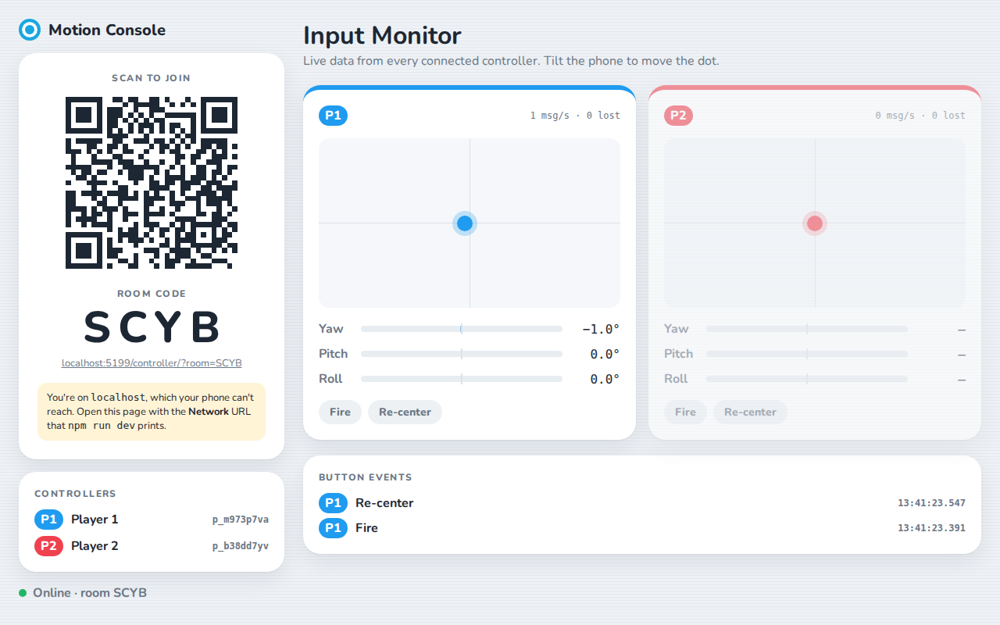
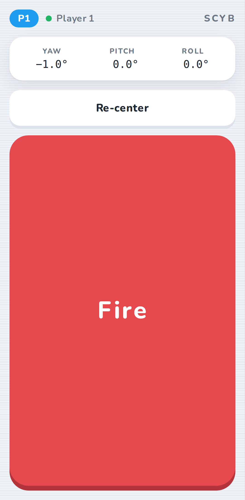
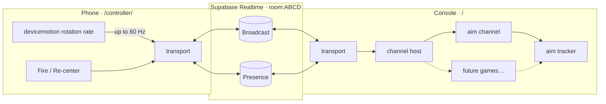

# Motion Console

A Wii-inspired game console that runs in the browser, with your phone as the motion controller.
Open the console on a laptop or TV, scan the QR code with an Android phone, and the phone's
gyroscope becomes a pointer, with buttons.

**Live demo: [motion.volpster.net](https://motion.volpster.net)**. Open it on a laptop or TV, then scan the QR code with your phone.

<p>
  
  
</p>

**Status: Milestone 5.** After pairing, the console shows a **launcher menu**: point at a game and
pull the trigger to play. **Home** on your phone pauses, with Resume or Quit to menu. Two games so
far: **Target Practice** (hit rings before they vanish) and **Hoops** (shoot baskets
with a real shooting motion: set, push, snap). New games plug into the menu by adding a folder.

## How it works



1. The console picks a 4-letter room code (no `I` or `O`, which look like `1` and `0`). It joins
   the Supabase Realtime channel `room:<CODE>` and shows a QR code for `/controller/?room=<CODE>`.
   It also checks, through presence, that no other console already owns that code.
2. The phone joins the same channel and sends `sys/hello`. The console replies with `sys/welcome`
   and a player slot (P1–P4).
3. The phone forwards its gyroscope's raw rotation rate (how fast it's turning, in degrees per
   second) up to 60 times a second, each reading stamped with the phone's clock. It also sends a
   press and a release event for each button. The phone does no maths.
4. The console routes each message to the active **channel**: a pluggable screen such as a game,
   a menu, or the Milestone 2 Aim screen. Channels turn motion into a crosshair with the shared
   **aim tracker** (below).

### Design decisions

| Decision                                     | Why                                                                                                                                                                                                                                                                                                                           |
| -------------------------------------------- | ----------------------------------------------------------------------------------------------------------------------------------------------------------------------------------------------------------------------------------------------------------------------------------------------------------------------------- |
| **Vanilla JS + Vite, no framework**          | The app is two small pages plus a hot input loop, and future games will draw to canvas. A reactive framework would sit between sensor events and pixels and add weight to the phone page without paying for itself. Vite provides ES modules, HMR, env vars, a multi-page build, and `import.meta.glob` for plugin discovery. |
| **One broadcast event, routing in our code** | Every message is the same envelope on a single Supabase event. The core routes by namespace (`ch`), so Supabase never needs to know which games exist.                                                                                                                                                                        |
| **Transport behind one module**              | `src/core/transport.js` is the only file that imports Supabase. Swapping to WebRTC data channels for lower latency would change one file.                                                                                                                                                                                     |
| **A dumb phone, a smart console**            | The phone sends raw sensor data and button presses, nothing else. All aiming maths, tuning, and calibration live on the console, so they can change (or differ per game) without touching the phone page.                                                                                                                     |
| **Rotation rate, not orientation angles**    | Rotation rate comes straight from the gyroscope, so it responds instantly and games can apply their own deadzone and smoothing. It has to be added up over time (integrated), which the aim tracker does.                                                                                                                     |
| **Integrate by the phone's timestamps**      | Messages cross the internet in uneven bursts. Each sample carries the time the phone measured it, and the console replays samples by those times, so network jitter doesn't change crosshair speed.                                                                                                                           |
| **Rate-capped sending**                      | Phones fire `devicemotion` at 50–200+ Hz. Capping at 60 Hz keeps bandwidth and Supabase's message quota predictable; the timestamps mean skipped readings don't distort aiming.                                                                                                                                               |
| **Re-centering on the console**              | Re-center snaps the crosshair to the middle in the aim tracker. The phone just reports the button, so every game gets the same behaviour for free.                                                                                                                                                                            |
| **DOM updates once per frame**               | Messages only update state. `requestAnimationFrame` writes to the DOM, so 60 messages a second never cause 60 layouts.                                                                                                                                                                                                        |
| **`core/` has no DOM**                       | The protocol, IDs, and emitter are pure and unit-tested. So is the aiming maths in `src/aim/`.                                                                                                                                                                                                                                |

## Message protocol

Every message is one envelope:

```js
{
  v: 2,              // protocol version; other versions are dropped
  ch: 'input',       // namespace: 'sys' | 'input' | <channel id>
  type: 'motion',    // message type within the namespace
  from: 'p_k3j9x2qa',// sender id
  to: 'console_…',   // optional: unicast. Omitted = everyone in the room
  seq: 1042,         // per-sender counter, used to count lost messages
  d: { … }           // payload
}
```

| `ch`           | `type`    | Direction                | `d`                                                     |
| -------------- | --------- | ------------------------ | ------------------------------------------------------- |
| `sys`          | `hello`   | controller → console     | `{}`                                                    |
| `sys`          | `welcome` | console → one controller | `{ slot: 1-4 \| null, channel }`                        |
| `sys`          | `channel` | console → all            | `{ id }` (active channel changed)                       |
| `input`        | `motion`  | controller → console     | `{ alpha, beta, gamma, gx, gy, gz, t }`: see below      |
| `input`        | `button`  | controller → console     | `{ id: 'fire' \| 'recenter' \| 'home', down: boolean }` |
| `output`       | `vibrate` | console → one controller | `{ pattern }`, as for `navigator.vibrate()`, ≤ 1 s      |
| `<channel id>` | anything  | either way               | defined by that channel                                 |

`alpha`, `beta`, and `gamma` are the phone's raw rotation rate in degrees per second
([`DeviceMotionEvent.rotationRate`](https://developer.mozilla.org/docs/Web/API/DeviceMotionEvent/rotationRate)).
Which phone axis each one means depends on the browser (see [Aiming](#aiming)). `gx`, `gy`, `gz`
are the accelerometer including gravity, in m/s² along the phone's x, y, z axes; they're omitted
if the phone doesn't provide them.
`t` is when the phone measured them, in milliseconds on the phone's own clock; only the gaps
between samples matter. `sys`, `input`, and `output` are reserved. Any other `ch` value
belongs to the channel with that id, which isolates games from the core and from each other.

## Aiming

`src/aim/` turns a phone's spin into a crosshair position. Every game should use it rather than
doing its own maths. The code comments explain each step in plain language.

1. **Find left/right and up/down.** The gyroscope measures spin around the phone's own axes, but
   aiming happens in the room. The phone also sends its gravity reading, so the console knows which
   way is up. Left/right is spin around the vertical, and up/down is spin around a flat
   left-to-right line. Twisting your wrist is neither, so it's ignored. This works whether the
   phone is held flat like a TV remote, upright like a camera, or anywhere in between.
2. **Deadzone.** Turning slower than a threshold counts as still, so sensor noise and shaky hands
   don't make the crosshair creep.
3. **Integrate.** Speed × time = distance: each sample moves the crosshair by
   `rate × (time since the previous sample) × sensitivity`, using the phone's timestamps.
   At sensitivity 1, a 30° turn crosses one screen height; at the default 1.8×, about 17° does.
4. **Clamp.** The crosshair stops at the edges and comes back as soon as you turn back.
5. **Smooth.** The drawn crosshair glides towards the true position each frame, which hides jitter.
   The formula is frame-rate independent, so it feels the same at 60 Hz and 120 Hz.

Positions are in _screen heights_ from the centre, so the same wrist movement feels the same on a
laptop and a TV. `toPixels()` converts them for drawing.

**Browsers disagree about the axes.** The W3C spec says `alpha` is the spin around the axis out of
the screen, but Chrome on Android reports `alpha`, `beta`, `gamma` as the x, y, z axes in order.
Mixing them up turns wrist twists into aiming. The default is Android Chrome's order, and the tuning
panel can switch it.

**Tuning.** Press <kbd>D</kbd> on the console to open a panel with sliders for sensitivity,
deadzone, and smoothing, an axis-order menu, and each controller's live raw values next to the
turn/tip speeds aiming uses. Settings apply instantly and are saved in that browser.

## Writing a channel

A channel is a folder. Create `src/channels/<id>/index.js`:

```js
import { createAimTracker, loadAimSettings, toPixels } from '../../aim/index.js';
import { BUTTONS, INPUT } from '../../core/protocol.js';

/** @type {import('../../console/channel-host.js').Channel} */
export default {
  title: 'Target Practice',

  mount(root, api) {
    root.innerHTML = '<canvas></canvas>';
    const tracker = createAimTracker(loadAimSettings());

    api.onInput(INPUT.MOTION, (sample, { player }) => tracker.push(player.id, sample));
    api.onInput(INPUT.BUTTON, ({ id, down }, { player }) => {
      if (id === BUTTONS.RECENTER && down) tracker.recenter(player.id);
      if (id === BUTTONS.FIRE && down) {
        /* check for a hit at tracker.get(player.id) */
      }
    });

    let frame = requestAnimationFrame(function loop(now) {
      tracker.update(now, 16 / 9);
      /* draw each player at toPixels(tracker.get(player.id), { width, height }) */
      frame = requestAnimationFrame(loop);
    });

    return () => cancelAnimationFrame(frame); // optional teardown
  },
};
```

`src/channels/index.js` discovers the folder with `import.meta.glob`, and Vite code-splits it
into its own chunk. No file in `core/` or `console/` changes. Subscriptions made through `api`
are removed automatically when the channel stops. [`src/channels/aim`](src/channels/aim/index.js)
is a complete working example.

The console runs the **launcher** channel by default. Developer tools are still channels you can
open with `?channel=<id>` on the console URL: `?channel=aim` for the aiming sandbox, or
`?channel=monitor` for the raw Input Monitor.

## Games

A game is a folder in `src/games/` with two files. Add the folder and the game appears in the
launcher menu; nothing else changes. [`src/games/game.js`](src/games/game.js) has the full contract.

- **`meta.js`**: what the menu shows. It's tiny, so the menu loads every game's `meta.js` up front.

  ```js
  export default {
    id: 'target-practice', // must match the folder name
    name: 'Target Practice',
    description: 'Aim with your phone and hit the rings before they vanish.',
    art: '<svg …>…</svg>', // optional tile picture
  };
  ```

- **`index.js`**: the game itself, downloaded only when someone picks it.

  ```js
  export default {
    ...meta,
    start(container, controller) {
      /* draw into container; listen with controller.onInput(...); buzz with controller.vibrate(...) */
    },
    stop() {
      /* undo everything: loops, timers, listeners, sounds, elements */
    },
    pause() {
      /* optional: freeze everything */
    },
    resume() {
      /* optional: carry on from where pause() stopped */
    },
  };
  ```

`controller` lets a game see the players (`players.list()`, `players.onChange()`), hear their phones
(`onInput(INPUT.MOTION | INPUT.BUTTON, …)`), and buzz them (`vibrate(playerId, pattern)`). Use the
shared aim tracker in `src/aim/` for anything that points.

### The launcher

- One tile per game, plus a "More games" placeholder. Every player's crosshair shows on the
  menu, and a tile lights up in the colour of whoever points at it. Fire starts it. You can also
  click a tile on the console, which is handy without a phone.
- **Home** on any phone, or **Esc** on the console, pauses the game: it freezes, and a pause
  screen offers **Resume** or **Quit to menu**, picked by pointing and pulling the trigger. Home
  again also resumes. Resuming runs a 3-2-1 countdown so players can get their aim back.
- The game also pauses by itself if a player's phone disconnects or the console tab is hidden.
- While paused, the launcher stops phone input reaching the game, so the trigger on the pause
  screen can't also fire in the game. Games without `pause()`/`resume()` quit straight to the menu
  on Home.
- Each game gets its own copy of `controller`; when it stops, the launcher removes any
  subscriptions the game forgot. Timers and window listeners are still the game's job in `stop()`.
- The running game is kept in the address bar (`?game=target-practice`), so reloading the console
  goes straight back into it, and a link can open a game directly.
- Press <kbd>D</kbd> on the menu for the aim tuning panel.

### Target Practice

Title screen → 3-2-1 countdown → 60-second round → results → trigger to play again.

- Ring targets pop up at random, clear of the top bar, and vanish after about 2 seconds. Up to
  three are on screen at once.
- Outer ring 10, middle 25, bullseye 50. Five hits in a row doubles your points, ten triples
  them, and a miss resets the streak.
- **Gold** targets (about 1 in 8) are smaller and quicker but worth ×3, on top of the streak
  multiplier. **Bombs** (about 1 in 10, after the first 5 seconds) cost 100 points and reset
  your streak if you shoot them; letting one vanish is free. There's always at least one real
  target on screen.
- Targets shrink to about 40% of their starting size and vanish sooner as the round goes on.
- Hits burst and float their points, and buzz the phone hard; misses puff and buzz lightly.
  Sounds are synthesized with the Web Audio API. Browsers only allow sound after a click on the
  console page, so there's a button for that.
- Results show score, accuracy, best streak, gold hit, bombs hit, and personal best (saved in
  the browser).
- Single-player for now: the lowest-numbered player plays.

**Tuning the feel.** Every timing, size, and point value is in the `CONFIG` object at the top of
[`src/games/target-practice/index.js`](src/games/target-practice/index.js). Settings written as
`{ start, end }` ramp evenly over the round. The rules themselves live in `round.js`, which has
no screen or sound code and is unit-tested.

### Hoops

An arcade basketball shootout, and the first game that reads a **gesture** rather than just
pointing. Same flow as Target Practice: title → 3-2-1 → 60 seconds → results.

- **Aim** by turning the phone left or right; the crosshair sits at rim height so you can line it
  up with the hoop.
- **Shoot like it's the ball**, in three parts:
  1. **Set**: raise the phone and cock your wrist back so the top edge points up, and hold it a
     moment. The ball on screen lifts and glows, the phone ticks, and your aim locks.
  2. **Push**: extend your arm upwards. The accelerometer measures the push, and **how hard you
     push sets the power**: every shot leaves at the same arc, so too soft falls short and too hard
     flies long.
  3. **Snap**: flick your wrist forwards. That releases the ball.

  A tap, a wave, or a lazy wrist flick doesn't shoot. If a shot fizzles, a hint says what was
  missing ("Push with your arm!" or "Snap your wrist to release!").

- A **power meter** shows each shot's push against the sweet spot. Holding **Fire** to charge a
  shot only works for phones that send no motion data (no gyroscope).
- The ball flies in 3D with gravity and bounces off the rim, backboard, and floor, so shots can
  swish, bank in, rattle in, or rim out. Shots still in the air at the buzzer count.
- A basket is 2, a swish 3. Three makes in a row puts you **on fire**: ×2 until you miss. The
  hoop starts sliding side to side halfway through the round.

How the shot is spotted ([`shot.js`](src/games/basketball/shot.js)): the aim tracker reports, for
every motion sample, the phone's **tilt** (how far the top edge points up, from gravity), its
**lift** (upward push, from the accelerometer minus gravity), and its **pitch rate** (how fast it
tips, from the gyroscope). A small state machine walks through ready → set → pushing → shot, and
anything out of order fizzles.

**Tuning the feel.** Press <kbd>D</kbd> in Hoops for a live graph of tilt, push, and snap, with the
detection thresholds drawn as dashed lines and markers for each set, push, shot, and fizzle. Make
a few real shots, see where your lines peak, and adjust `CONFIG.shot` in
[`src/games/basketball/index.js`](src/games/basketball/index.js) (the thresholds, and `weakest` /
`strongest` for power). `CONFIG` also holds the court (real metres), scoring, and bounciness. The
physics in `court.js` and the detector in `shot.js` are unit-tested.

### Shared by games

`src/games/shared/` holds what games have in common: `synth.js` (Web Audio sound effects from
tones and noise, no files) and `personal-best.js` (a best score per game in the browser). The aim
tracker's `onMotion()` lets any game watch each motion sample (turn and tip speeds, tilt, and
upward push), for gestures like a basketball shot or a bat swing.

## Project structure

```
index.html                  console page
controller/index.html       controller page (served at /controller/)
src/
  core/                     shared by both pages, no DOM
    protocol.js             envelope format, namespaces, message types
    transport.js            Supabase Realtime room (the only Supabase import)
    ids.js                  room codes and client ids
    emitter.js              tiny error-isolating event emitter
    players.js              slot count and colours
    config.js               env var loading
  console/
    main.js                 room claim, QR, handshake, player list
    players.js              slot assignment
    channel-host.js         mounts channels, routes messages (+ Channel API types)
  controller/
    main.js                 join flow, handshake, buttons
    motion.js               devicemotion wrapper (raw rotation rate + timestamp)
    motion-stream.js        rate-capped sender (tested)
    device.js               fullscreen, wake lock, vibration
  aim/                      shared aiming for every game, no DOM except the panel
    aim-math.js             deadzone, integration, clamping, smoothing (pure, tested)
    aim-tracker.js          one crosshair per player; what games use (tested)
    aim-settings.js         sensitivity/deadzone/smoothing defaults and saving
    debug-panel.js          hidden tuning panel (press D)
  games/
    game.js                 the game contract (meta + start/stop)
    index.js                game discovery: listGames(), loadGame()
    shared/                 helpers any game can use
      synth.js              Web Audio sound effects from tones and noise
      personal-best.js      best score per game, in localStorage
    target-practice/        Milestone 3: the first game
      meta.js               name, description, and tile art for the menu
      index.js              CONFIG, screens, and the game loop
      round.js              rules: spawning, difficulty, scoring (pure, tested)
      render.js             canvas drawing: targets, effects, crosshair
      sounds.js             sound effects
    basketball/             Milestone 5: Hoops
      meta.js               name, description, and tile art for the menu
      index.js              CONFIG, screens, shooting, and the game loop
      court.js              3D ball flight, bounces, scoring, perspective (pure, tested)
      shot.js               spotting set → push → snap (pure, tested)
      tuning.js             the shot-tuning graph (press D)
      render.js             canvas drawing: court, hoop, net, balls
      sounds.js             sound effects
  channels/
    index.js                channel discovery and loading
    launcher/               Milestone 4: the home menu (the default channel)
      index.js              menu ↔ loading ↔ playing ↔ paused, Home and Esc, ?game=
      menu.js               the game tiles
      picker.js             point-and-shoot picking, shared by the menu and pause screen
      pause.js              the pause screen and resume countdown
      scoped-controller.js  per-game controller: mutes input while paused, cleans up (tested)
    aim/                    Milestone 2: aiming sandbox (?channel=aim)
    monitor/                raw input monitor (?channel=monitor)
  ui/                       shared styles and DOM helpers
```

## Setup

### 1. Supabase

The app uses **Broadcast** and **Presence** only. There are no tables, no SQL, and no RLS policies.

1. Create a project at [supabase.com](https://supabase.com). The free plan is fine; pick a
   region close to you, because every message round-trips through it.
2. Copy two values. Both are also listed in the **Connect** dialog on the project home page:
   - **Project URL**: **Project Settings → Data API** (`https://<project-ref>.supabase.co`).
   - **Publishable key**: **Project Settings → API Keys** (`sb_publishable_…`). A legacy
     **anon** key also works. Never use the secret/`service_role` key: this key ships to the browser.
3. Open **Realtime → Settings** and make sure public channel access is **allowed**, which is the
   default. This app uses public channels. If "private channels only" is turned on, joins fail
   with an authorization error.

That's all. Channels are created on the fly when the first client joins `room:<CODE>`.

### 2. Run locally

```bash
npm install
cp .env.example .env.local   # then fill in the two values
npm run dev
```

Phones only expose motion sensors over **HTTPS**, so the dev server uses a self-signed
certificate and listens on your LAN. Open the console with the **Network** URL that Vite prints
(e.g. `https://192.168.1.20:5173`), not `localhost`: the QR code points at whatever host the
console was opened on. Your phone must be on the same Wi-Fi. It will warn about the certificate
once; accept it to continue.

You can also test the controller on a desktop: it has no sensor, but **Space** fires and **R**
re-centers.

### 3. Deploy to Vercel

1. Push the repo to GitHub and import it in Vercel. It detects Vite automatically
   (build `npm run build`, output `dist`).
2. Add `VITE_SUPABASE_URL` and `VITE_SUPABASE_PUBLISHABLE_KEY` under
   **Settings → Environment Variables** for Production and Preview.
3. Redeploy. Vite inlines these values at build time, so a deploy that ran before you added
   them has no config and shows an error screen.

## Scripts

| Command           |                             |
| ----------------- | --------------------------- |
| `npm run dev`     | HTTPS dev server on the LAN |
| `npm run build`   | production build to `dist/` |
| `npm run preview` | serve the production build  |
| `npm test`        | unit tests (Vitest)         |
| `npm run format`  | Prettier                    |

Tuning: add `?hz=30` to a controller URL to change its send rate (10–60, default 60). Press
<kbd>D</kbd> on the console for the aim tuning panel.

## Limitations and roadmap

- **Quota.** Supabase meters Realtime messages per second and per month. At 60 Hz one controller
  sends about 216k messages an hour, and every broadcast is also delivered to everyone else in the
  room. Several players can hit free-tier limits, so check your plan's quotas, or lower the rate
  with `?hz=30`.
- **Latency.** Every message goes through a Supabase region, which typically adds tens of
  milliseconds. That's fine for pointing and Wii-style party games. A WebRTC data channel,
  signalled over this same room, is the upgrade path, and `transport.js` is the seam for it.
- **Room security.** Rooms are public: anyone who knows a 4-letter code can join it. Next step:
  private channels with Supabase anonymous sign-ins and an RLS policy on `realtime.messages`.
- **Gravity is approximate while moving.** The accelerometer feels hand movement as well as
  gravity. The console follows it slowly to filter that out, but fast, jerky swings can briefly
  tilt its idea of "up".
- **Drift.** Adding up speeds over time also adds up tiny sensor errors, so after a while the
  crosshair and the phone can disagree about where "centre" is. The deadzone slows this down, and
  Re-center fixes it.
- **Console reload reassigns slots.** Controllers reconnect automatically but may swap slot numbers.
- **Shooting motions vary by person.** Hoops' shot thresholds are starting guesses; the D graph
  shows real motions to tune them from. Per-player calibration would be a nice next step.
- Next milestones: a baseball home-run derby (swing timing, which needs network-delay
  compensation), multiplayer, and controller-side game UIs
  (`sys/channel` already tells phones which channel is active).
