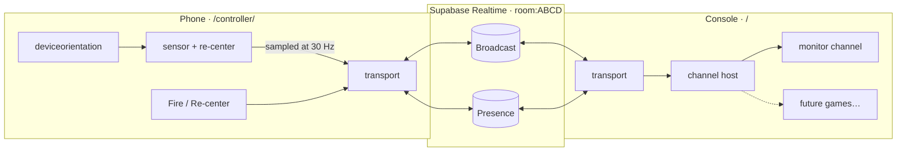

# Motion Console

A Wii-inspired game console that runs in the browser, with your phone as the motion controller.
Open the console on a laptop or TV, scan the QR code with an Android phone, and the phone's
gyroscope becomes a pointer, with buttons.

**Live demo: [motion.volpster.net](https://motion.volpster.net)**. Open it on a laptop or TV, then scan the QR code with your phone.

<p>
  
  
</p>

**Status: Milestone 1.** Pairing, live orientation, and buttons work end to end. Games come next.

## How it works



1. The console picks a 4-letter room code (no `I` or `O`, which look like `1` and `0`). It joins
   the Supabase Realtime channel `room:<CODE>` and shows a QR code for `/controller/?room=<CODE>`.
   It also checks, through presence, that no other console already owns that code.
2. The phone joins the same channel and sends `sys/hello`. The console replies with `sys/welcome`
   and a player slot (P1–P4).
3. The phone samples its orientation at a fixed rate, sending only when the pose changes plus a
   1 s keepalive. It also sends a press and a release event for each button.
4. The console routes each message to the active **channel**: a pluggable screen such as a game,
   a menu, or the Milestone 1 Input Monitor.

### Design decisions

| Decision                                             | Why                                                                                                                                                                                                                                                                                                                           |
| ---------------------------------------------------- | ----------------------------------------------------------------------------------------------------------------------------------------------------------------------------------------------------------------------------------------------------------------------------------------------------------------------------- |
| **Vanilla JS + Vite, no framework**                  | The app is two small pages plus a hot input loop, and future games will draw to canvas. A reactive framework would sit between sensor events and pixels and add weight to the phone page without paying for itself. Vite provides ES modules, HMR, env vars, a multi-page build, and `import.meta.glob` for plugin discovery. |
| **One broadcast event, routing in our code**         | Every message is the same envelope on a single Supabase event. The core routes by namespace (`ch`), so Supabase never needs to know which games exist.                                                                                                                                                                        |
| **Transport behind one module**                      | `src/core/transport.js` is the only file that imports Supabase. Swapping to WebRTC data channels for lower latency would change one file.                                                                                                                                                                                     |
| **Fixed-rate sampling, not per-event sending**       | Phones fire `deviceorientation` at different rates. Sampling at a fixed rate caps bandwidth, which keeps the app inside Supabase's messages-per-second quota and makes rates predictable for games.                                                                                                                           |
| **Presence for membership, messages for handshakes** | Presence answers "who is here?" and catches silent disconnects. The hello/welcome exchange answers "which slot am I?" A controller re-sends hello whenever a console (re)appears, so reloading either side recovers on its own.                                                                                               |
| **Re-centering on the phone**                        | Games receive angles already relative to the player's chosen centre, so no game has to reimplement calibration.                                                                                                                                                                                                               |
| **DOM updates once per frame**                       | Messages only update state. `requestAnimationFrame` writes to the DOM, so 60 messages a second never cause 60 layouts.                                                                                                                                                                                                        |
| **`core/` has no DOM**                               | The protocol, IDs, emitter, and orientation math are pure and unit-tested.                                                                                                                                                                                                                                                    |

## Message protocol

Every message is one envelope:

```js
{
  v: 1,              // protocol version; other versions are dropped
  ch: 'input',       // namespace: 'sys' | 'input' | <channel id>
  type: 'orient',    // message type within the namespace
  from: 'p_k3j9x2qa',// sender id
  to: 'console_…',   // optional: unicast. Omitted = everyone in the room
  seq: 1042,         // per-sender counter, used to count lost messages
  d: { … }           // payload
}
```

| `ch`           | `type`    | Direction                | `d`                                               |
| -------------- | --------- | ------------------------ | ------------------------------------------------- |
| `sys`          | `hello`   | controller → console     | `{}`                                              |
| `sys`          | `welcome` | console → one controller | `{ slot: 1-4 \| null, channel }`                  |
| `sys`          | `channel` | console → all            | `{ id }` (active channel changed)                 |
| `input`        | `orient`  | controller → console     | `{ yaw, pitch, roll }` in degrees, 0.1° precision |
| `input`        | `button`  | controller → console     | `{ id: 'fire' \| 'recenter', down: boolean }`     |
| `<channel id>` | anything  | either way               | defined by that channel                           |

Orientation is relative to the last re-center. Positive **yaw** points right, positive **pitch**
points up, and positive **roll** tilts right. `sys` and `input` are reserved. Any other `ch` value
belongs to the channel with that id, which isolates games from the core and from each other.

## Writing a channel

A channel is a folder. Create `src/channels/<id>/index.js`:

```js
import { BUTTONS, INPUT } from '../../core/protocol.js';

/** @type {import('../../console/channel-host.js').Channel} */
export default {
  title: 'Target Practice',

  mount(root, api) {
    root.innerHTML = '<canvas></canvas>';

    api.onInput(INPUT.ORIENT, ({ yaw, pitch }, { player }) => {
      /* aim player.slot's cursor */
    });
    api.onInput(INPUT.BUTTON, ({ id, down }, { player }) => {
      if (id === BUTTONS.FIRE && down) api.send('shot', { hit: true }, player.id);
    });

    return () => {
      /* optional teardown: stop loops, release resources */
    };
  },
};
```

`src/channels/index.js` discovers the folder with `import.meta.glob`, and Vite code-splits it
into its own chunk. No file in `core/` or `console/` changes. Subscriptions made through `api`
are removed automatically when the channel stops. [`src/channels/monitor`](src/channels/monitor/index.js)
is a complete working example.

## Project structure

```
index.html                  console page
controller/index.html       controller page (served at /controller/)
src/
  core/                     shared by both pages, no DOM
    protocol.js             envelope format, namespaces, message types
    transport.js            Supabase Realtime room (the only Supabase import)
    ids.js                  room codes and client ids
    emitter.js              tiny error-isolating event emitter
    players.js              slot count and colours
    config.js               env var loading
  console/
    main.js                 room claim, QR, handshake, player list
    players.js              slot assignment
    channel-host.js         mounts channels, routes messages (+ Channel API types)
  controller/
    main.js                 join flow, handshake, buttons
    orientation.js          deviceorientation wrapper
    orientation-math.js     re-center math (pure, tested)
    orientation-stream.js   fixed-rate sampler (tested)
    device.js               fullscreen, wake lock, vibration
  channels/
    index.js                channel discovery and loading
    monitor/                Milestone 1: live input monitor
  ui/                       shared styles and DOM helpers
```

## Setup

### 1. Supabase

Milestone 1 uses **Broadcast** and **Presence** only. There are no tables, no SQL, and no RLS policies.

1. Create a project at [supabase.com](https://supabase.com). The free plan is fine; pick a
   region close to you, because every message round-trips through it.
2. Copy two values. Both are also listed in the **Connect** dialog on the project home page:
   - **Project URL**: **Project Settings → Data API** (`https://<project-ref>.supabase.co`).
   - **Publishable key**: **Project Settings → API Keys** (`sb_publishable_…`). A legacy
     **anon** key also works. Never use the secret/`service_role` key: this key ships to the browser.
3. Open **Realtime → Settings** and make sure public channel access is **allowed**, which is the
   default. This app uses public channels. If "private channels only" is turned on, joins fail
   with an authorization error.

That's all. Channels are created on the fly when the first client joins `room:<CODE>`.

### 2. Run locally

```bash
npm install
cp .env.example .env.local   # then fill in the two values
npm run dev
```

Phones only expose motion sensors over **HTTPS**, so the dev server uses a self-signed
certificate and listens on your LAN. Open the console with the **Network** URL that Vite prints
(e.g. `https://192.168.1.20:5173`), not `localhost`: the QR code points at whatever host the
console was opened on. Your phone must be on the same Wi-Fi. It will warn about the certificate
once; accept it to continue.

You can also test the controller on a desktop: it has no sensor, but **Space** fires and **R**
re-centers.

### 3. Deploy to Vercel

1. Push the repo to GitHub and import it in Vercel. It detects Vite automatically
   (build `npm run build`, output `dist`).
2. Add `VITE_SUPABASE_URL` and `VITE_SUPABASE_PUBLISHABLE_KEY` under
   **Settings → Environment Variables** for Production and Preview.
3. Redeploy. Vite inlines these values at build time, so a deploy that ran before you added
   them has no config and shows an error screen.

## Scripts

| Command           |                             |
| ----------------- | --------------------------- |
| `npm run dev`     | HTTPS dev server on the LAN |
| `npm run build`   | production build to `dist/` |
| `npm run preview` | serve the production build  |
| `npm test`        | unit tests (Vitest)         |
| `npm run format`  | Prettier                    |

Tuning: add `?hz=60` to a controller URL to change its send rate (10–60, default 30).

## Limitations and roadmap

- **Quota.** Supabase meters Realtime messages per second and per month. At 30 Hz one moving
  controller sends about 108k messages an hour. Four players at 60 Hz can hit free-tier limits,
  so check your plan's quotas before raising the rate.
- **Latency.** Every message goes through a Supabase region, which typically adds tens of
  milliseconds. That's fine for pointing and Wii-style party games. A WebRTC data channel,
  signalled over this same room, is the upgrade path, and `transport.js` is the seam for it.
- **Room security.** Rooms are public: anyone who knows a 4-letter code can join it. Next step:
  private channels with Supabase anonymous sign-ins and an RLS policy on `realtime.messages`.
- **Re-centering uses Euler offsets.** This is accurate for pointing near the centre. Quaternion
  re-centering would handle extreme poses and portrait/landscape changes properly.
- **Console reload reassigns slots.** Controllers reconnect automatically but may swap slot numbers.
- Next milestones: a channel picker menu, the first game, and controller-side channel UIs
  (`sys/channel` already tells phones which channel is active).
